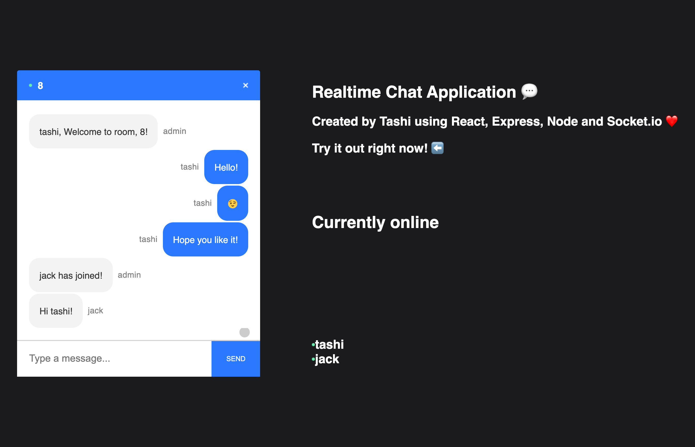
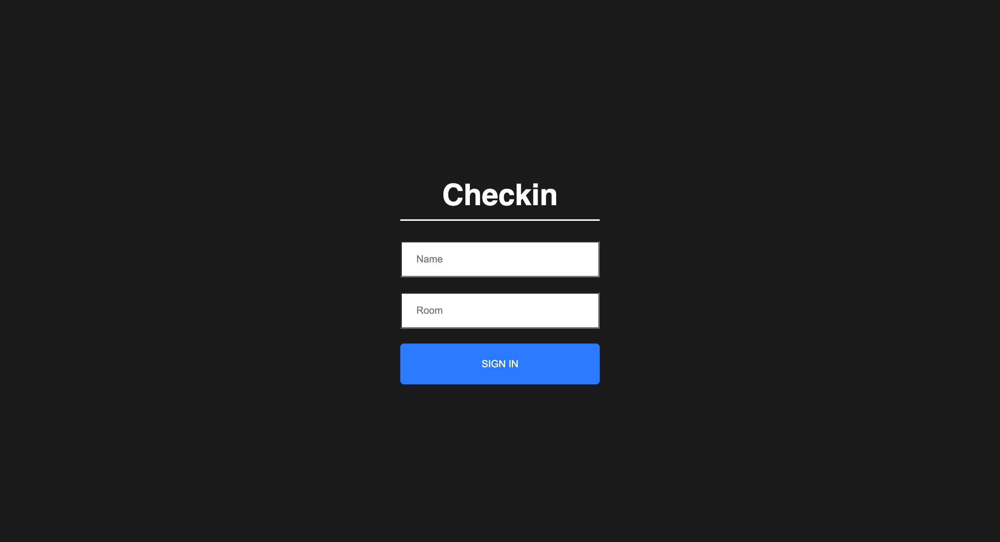

# Real Time Chat Application

Check it out at https://realtimechatbytashi.netlify.app

## Features

- Real time functioning through Socket.io since HTTP requests, though good for serving up websites, are slow.
- Used query strings - retreive data from URL and not through props or Redux
- Displays the Active users in any particular given room
- Admin to display welcome, who has joined/left messages
- Emoji conversion from characters to actual emojis using react-emoji [eg :) ]
- Automatic scrolling to user's last message for efficient real-time chatting using react-scroll-to-bottom

## Installations

- cors, nodemon, express, socket.io on server side
- react-router, socket.io-client, react-scroll-to-botoom, react-emoji, query-string on client side

### Tech Stack

- React, Express, NodeJS, Socket.io, CSS, JavaScript

### Chat Application Webpage

### Chat Login Page

